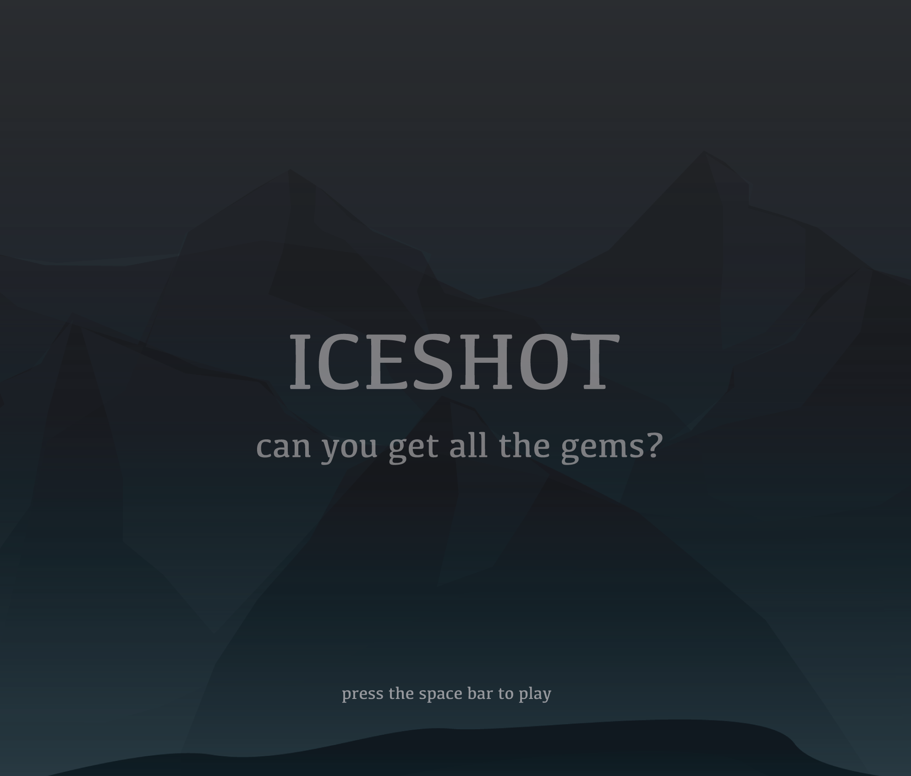

# Platform Side Scrolling Game Simulation
Interactive Arts and Technology - IAT167 Final Project

[Video Demo](https://www.youtube.com/watch?v=vC6UjPunI-8&t=266s)

<h2>Game Overview</h2>
<strong>Beginning Narrative:</strong> A fellow traveller tells the player that there is a mountain of rare gems and diamonds hidden away deep within an icy complex.  The traveller leads the player to the entrance of the icy complex but doesn’t enter with the player because of the dangers that lie inside.  
  
<strong>During the game:</strong> The player must travel through the entire icy complex to get to the mountain of jewels at the end of the game.  It takes three days to get through the entire complex (1 day per level).  Along the way, there will be many dangers that can kill the player.  If the player can get to the end of the final level without getting killed, then they win. 
